<div align="center">

# ⛨ TERMINUS CITY

**Your terminal, rendered as a skyline.**

Terminus City watches your local development activity, strips it down to a handful of safe metadata fields, and grows a procedural isometric city out of what's left. Every tower is a command family. Every district is a directory you've hashed. Nothing leaves `127.0.0.1`.

<br>

[](https://nodejs.org)
[](package.json)
[](docs/SECURITY.md)
[](LICENSE)


<br>

`observe, never intercept` · `allowlist, never denylist` · `loopback, never egress`

</div>

---


## Quick start

```bash
npm run dev
```

Open **http://127.0.0.1:31338**. Then, from a second terminal, feed the city something:

```bash
node bin/terminus.mjs emit git status 0 82
```

A tower goes up. That's it — no account, no config file, no first-run wizard.

To wire it to your actual shell, see [Shell integration](#shell-integration).

> [!TIP]
> `terminus doctor` tells you what's working, where your data lives, and whether the relay is up. Run it first when something looks wrong.

---

## What it looks like

<div align="center">


</div>

Buildings rise with activity and lose health when commands exit nonzero. Districts take a palette from a hash of their directory key, so the same project is the same color on every machine — without either machine knowing the path.

---

## How it works

```mermaid
flowchart LR
    A["shell hook<br/>bash / zsh"] -->|raw command line| B["sanitizer<br/>allowlist + hash"]
    B -->|"{command, category, cwdKey}"| C["terminus emit"]
    C -->|"POST /events<br/>loopback only"| D["relay<br/>127.0.0.1:31338"]
    D --> E["append-only log<br/>events.jsonl"]
    E --> F["reduceCity()<br/>pure reducer"]
    F --> G["city state"]
    G -->|"WebSocket"| H["canvas<br/>isometric render"]

    style B fill:#8a6cff,stroke:#000,color:#fff
    style D fill:#47d9e4,stroke:#000,color:#000
    style F fill:#ffb75f,stroke:#000,color:#000
```



The important property is **where the boundary sits**. Sanitization happens in the agent, before anything is serialized — so the raw command line never exists as a value the relay, the log, or the browser could leak. Everything downstream is an event-sourced reduction over data that was already safe.

---

## What actually gets stored

Here's a real record, in full. This is everything:

```json
{
  "v": 1,
  "id": "9f1c…",
  "ts": 1754960000000,
  "hostId": "local",
  "sessionId": "cli",
  "seq": 42,
  "type": "shell.command.finished",
  "payload": {
    "command": "git",
    "category": "git",
    "subcommand": "commit",
    "cwdKey": "path_0ae23d8c267790ab",
    "exitCode": 0,
    "durationMs": 412
  }
}
```

| Retained | Never touched |
| --- | --- |
| Command family, from a **fixed allowlist** | The raw command line |
| Subcommand, from a **per-command allowlist** | Arguments, flags, values |
| Exit code (0–255) | stdout / stderr |
| Duration in milliseconds | Environment variables |
| Keyed SHA-256 of the working directory | The working directory itself |
| Wall-clock timestamp | Shell history, network payloads |

Anything the allowlist doesn't recognize — a script path, a custom binary, an inline env assignment — collapses to `other`. That includes the cases most likely to carry a secret:

```console
$ AWS_SECRET_ACCESS_KEY=wJalr… aws s3 ls
  → { command: "other", category: "other", cwdKey: "path_0ae23d8c…" }

$ ./deploy-acmecorp-prod.sh --force
  → { command: "other", category: "other", cwdKey: "path_0ae23d8c…" }
```

Files and directories are created owner-only (`0700` / `0600`) where the platform supports it. Full threat model: **[docs/SECURITY.md](docs/SECURITY.md)**.

---

## Commands

| Command | What it does |
| --- | --- |
| `terminus start` | Start the local city relay |
| `terminus dev` | Start the relay and open its URL |
| `terminus status` | Report relay state and collection state |
| `terminus pause` | **Kill switch.** Stops collection immediately |
| `terminus resume` | Resume collection |
| `terminus emit CMD [SUB] [EXIT] [DURATION_MS]` | Send one sanitized event by hand |
| `terminus doctor` | Check the local installation |

`pause` writes the collection flag directly to disk, so it works whether or not the relay is running. That's deliberate — a kill switch that depends on the thing it's killing isn't a kill switch.

---

## Configuration

| Variable | Default | Purpose |
| --- | --- | --- |
| `TERMINUS_CITY_DATA_DIR` | `~/.local/share/terminus-city` | Where the log, state, and control flag live |
| `TERMINUS_CITY_PORT` | `31338` | Relay port |
| `XDG_DATA_HOME` | — | Respected when `TERMINUS_CITY_DATA_DIR` is unset |

The relay binds to `127.0.0.1` and validates the `Host` and `Origin` of every request, so a page you visit in another tab can't read your city or flip your kill switch.

---

## Shell integration

Source the hook for your shell from your rc file:

```bash
# ~/.bashrc
source /path/to/TerminusCity/packages/agent/shell/bash.sh
```

```zsh
# ~/.zshrc
source /path/to/TerminusCity/packages/agent/shell/zsh.sh
```

Two guarantees, both load-bearing:

- **The hook never blocks a command.** It fires asynchronously after the prompt returns. A relay that's down means a missed frame in the visualization, never a failed shell command.
- **The hook never sees more than the sanitizer allows.** It hands off the command line to `terminus emit`, which sanitizes before anything crosses the socket.

Set `TERMINUS_CITY_DISABLED=1` to silence the hook without unsourcing it.

---

## Event vocabulary

The protocol validates a stable envelope and deliberately accepts unknown future types, so a newer agent can talk to an older relay without a version handshake.

| Event type | Status |
| --- | --- |
| `shell.command.finished` | ✅ Shipped |
| `shell.command.started` | 🚧 Reserved |
| `git.repo.discovered` | 🚧 Validator + reducer, no producer yet |
| `git.commit` | 🚧 Validator + reducer, no producer yet |
| `git.branch.changed` | 🚧 Reserved |
| `test.run.finished` | 🚧 Reserved |
| `system.metrics` | 🚧 Validator + reducer, no producer yet |
| `container.started` | 🚧 Reserved |
| `network.summary` | 🚧 Reserved |

Reserved types are accepted and stored but nothing emits them yet — the schema is ahead of the collectors on purpose.

---

## Repo layout

```
TerminusCity/
├── bin/terminus.mjs              # CLI entry point
├── packages/
│   ├── protocol/src/index.mjs    # envelope + payload validation
│   ├── agent/
│   │   ├── src/sanitizer.mjs     # ← the privacy boundary
│   │   ├── src/store.mjs         # append-only log + state
│   │   └── shell/                # bash + zsh hooks
│   └── world/src/index.mjs       # pure reducer: events → city
├── apps/
│   ├── relay/src/server.mjs      # loopback HTTP + WebSocket
│   └── web/                      # canvas renderer, no framework
├── test/                         # node:test
└── docs/SECURITY.md
```

The reducer in `packages/world` is pure and deterministic: the same event stream always produces the same city, on any machine. That's what makes the log replayable and the state file disposable.

---

## Development

```bash
npm test        # node:test, no runner, no config
npm run doctor  # installation health
```

Zero dependencies is a feature, not an accident. Every dependency is a party you'd have to trust with the thing this project exists to protect. Adding one needs a real argument.

---

## Roadmap

- [ ] Git collector — commits, branch changes, repo discovery
- [ ] System metrics collector — the city gets weather
- [ ] Test-run collector — green and red skylines
- [ ] Self-hosted fonts, so the dashboard makes zero third-party requests
- [ ] Log compaction and a `terminus purge` that re-sanitizes history
- [ ] Packaged shell hook installer

---

<div align="center">

**[Security model](docs/SECURITY.md)** · **[Report an issue](../../issues)**

MIT © Backwoods Development

<sub>Built local-first, because a tool that watches your terminal should have to earn it.</sub>

</div>
